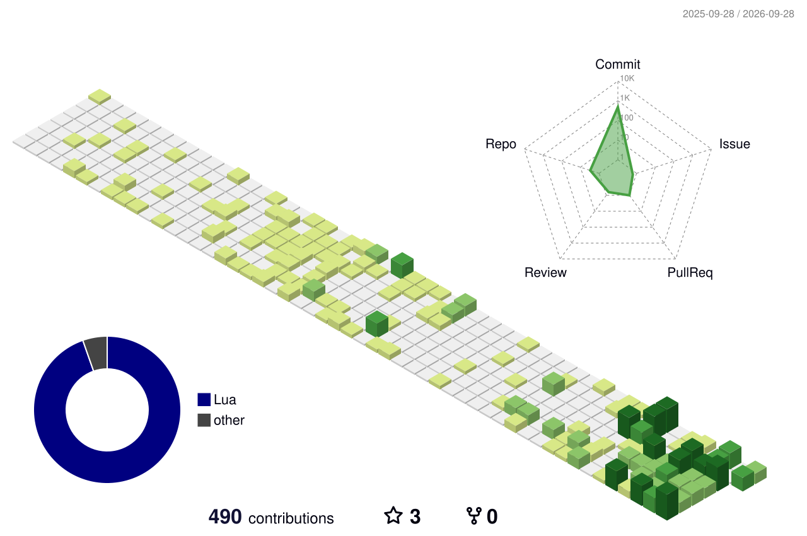

## Hi there 👋

Hi, I'm X3ru4, a guy with a lot of free time.

---

<h3 align="center">Tools and languages</h3>

  
  
  
  

<h3 align="center">Operating systems</h3>

  
  

---

<h3 align="center">Contribution</h3>

